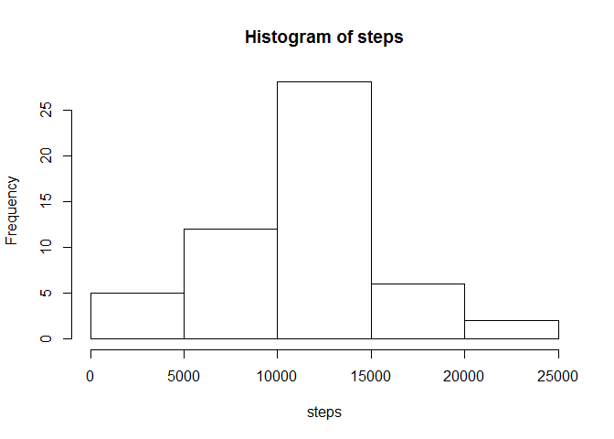
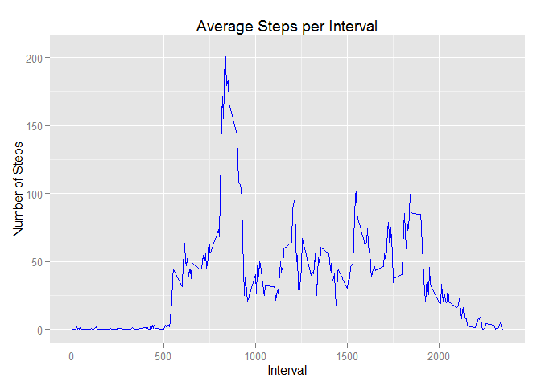
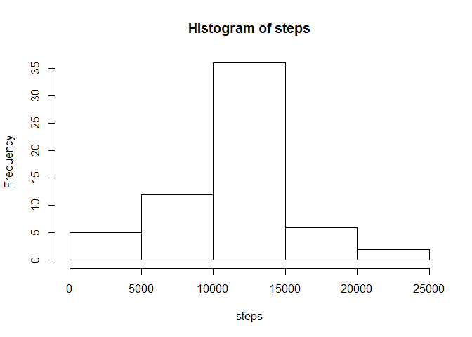
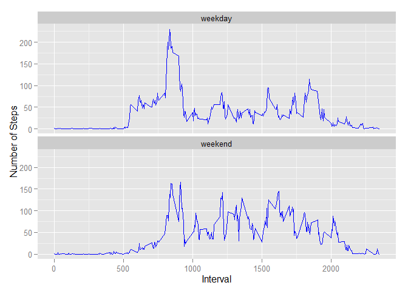

# Reproducible Research: Peer Assessment 1
Loading necessary libraries


```r
library(dplyr)
```

```
## 
## Attaching package: 'dplyr'
## 
## The following object is masked from 'package:stats':
## 
##     filter
## 
## The following objects are masked from 'package:base':
## 
##     intersect, setdiff, setequal, union
```

```r
library(ggplot2)
```

```
## Warning: package 'ggplot2' was built under R version 3.2.1
```

```r
library(sqldf)
```

```
## Warning: package 'sqldf' was built under R version 3.2.1
```

```
## Loading required package: gsubfn
```

```
## Warning: package 'gsubfn' was built under R version 3.2.1
```

```
## Loading required package: proto
```

```
## Warning: package 'proto' was built under R version 3.2.1
```

```
## Loading required package: RSQLite
```

```
## Warning: package 'RSQLite' was built under R version 3.2.1
```

```
## Loading required package: DBI
```

## Loading and preprocessing the data


```r
unzip ("activity.zip")
activity <- read.csv("activity.csv", header=TRUE)
compactivity <- activity[complete.cases(activity), ]
```

## What is mean total number of steps taken per day?

Calculate the total number of steps taken per day

```r
dailysteps <- aggregate(compactivity[, "steps"],list(compactivity$date), sum, 
                        na.rm=TRUE)
names(dailysteps) <- c("date","steps")
```

Make a histogram of the total number of steps taken each day

```r
hist(dailysteps$steps,main = "Histogram of steps",xlab = "steps")
```

 

Calculate and report the mean and median of the total number of steps taken per day

```r
dailysteps%>%
    summarise(Mean=mean(steps),  Median=median(steps))
```

```
##       Mean Median
## 1 10766.19  10765
```

## What is the average daily activity pattern?

Calculate and store average number of steps taken per interval


```r
intsteps <- aggregate(compactivity[, "steps"],list(compactivity$interval), mean)
names(intsteps) <- c("interval","steps")
```

Make a time series plot (i.e. type = "l") of the 5-minute interval (x-axis) and 
the average number of steps taken, averaged across all days (y-axis)


```r
ggplot(intsteps, aes(interval, steps)) + geom_line(type = "1",color="Blue") + 
    ylab("Number of Steps") + xlab("Interval") + 
    ggtitle("Average Steps per Interval")  
```

 

Which 5-minute interval, on average across all the days in the dataset, contains 
the maximum number of steps?

```r
subset(intsteps, intsteps$steps==max(intsteps$steps), select = interval)
```

```
##     interval
## 104      835
```

## Imputing missing values

Create a dataset containing the rows with NAs

```r
activityna <- activity[!complete.cases(activity), ]
```

Calculate and report the total number of missing values in the dataset 
(i.e. the total number of rows with NAs)

```r
nrow(activityna)
```

```
## [1] 2304
```

Fill all of the missing values in the dataset with mean number of steps for 
their 5-minute intervals

```r
activityna2 = merge(activityna,intsteps, by.x="interval",by.y= "interval", 
                    all=TRUE)
activityna2 <- activityna2[,c('steps.y','date','interval')]
activityna2$steps.y <-round(activityna2$steps.y)
names(activityna2) <- c('steps','date','interval')
```

Create a new dataset that is equal to the original dataset but with the missing 
data filled in.

```r
newactivity <- rbind(compactivity,activityna2 )
```

Calculate the total number of steps taken per day

```r
newdailysteps <- aggregate(newactivity[, "steps"],list(newactivity$date), sum, 
                        na.rm=TRUE)
names(newdailysteps) <- c("date","steps")
```

Make a histogram of the total number of steps taken each day

```r
hist(newdailysteps$steps,main = "Histogram of steps",xlab = "steps")
```

 

Calculate and report the mean and median of the total number of steps taken per day

```r
newdailysteps%>%
    summarise(Mean=mean(steps),  Median=median(steps))
```

```
##       Mean Median
## 1 10765.64  10762
```
 
Do these values differ from the estimates from the first part of the assignment?  
What is the impact of imputing missing data on the estimates of the total daily 
number of steps?  

The missing values in the dataset were filled with the mean number of steps for 
their corresponding 5-minute intervals.  The new values are slightly lower but very close to the estimates from the first part of the assignment.  The mean went down from 10766.19 to 10765.64 and the median went down from 10765 to 10762.Imputing missing data increased the total daily number of steps.


## Are there differences in activity patterns between weekdays and weekends?

Create a new factor variable in the dataset with two levels - "weekday" and 
"weekend" indicating whether a given date is a weekday or weekend day.

Get the day

```r
newactivity <- mutate(newactivity, day = weekdays(as.Date(newactivity$date)))
```

Get weekday indicator

```r
newactivity <- sqldf("select steps,date,interval,
                     case
                     when day like 'S%' then 'weekend'
                     else 'weekday'
                     end weekday
                     from newactivity")
```

```
## Loading required package: tcltk
```

Convert weekday indicator to factor

```r
newactivity$weekday <- as.factor(newactivity$weekday)
```

Calculate and store average number of steps taken perinterval per weekday factor

```r
newintsteps <- aggregate(newactivity[, "steps"],list(newactivity$weekday,
                                                  newactivity$interval), mean)
```

Rename the columns

```r
names(newintsteps) <- c("weekday","interval","steps")
```

Make a panel plot containing a time series plot (i.e. type = "l") of the 
5-minute interval (x-axis) and the average number of steps taken, averaged 
across all weekday days or weekend days (y-axis). 

```r
ggplot(newintsteps, aes(interval, steps)) + geom_line(type = "1",color="Blue") +
    ylab("Number of Steps") + xlab("Interval") + facet_wrap(~weekday, nrow=2) 
```

 
